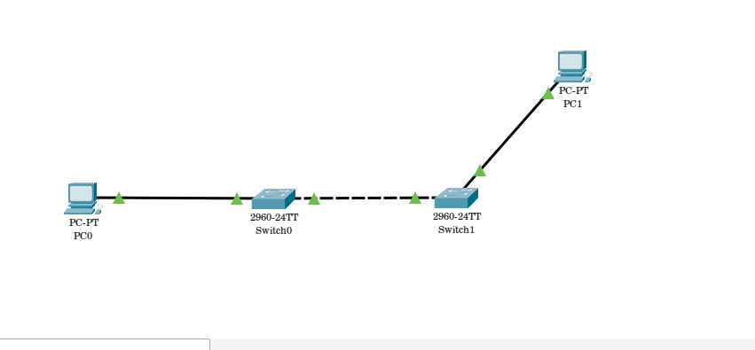
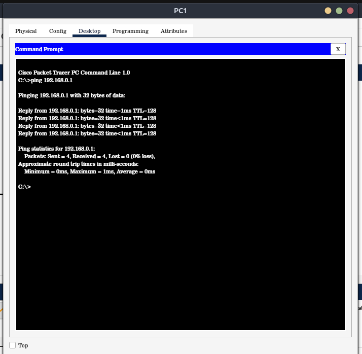

# 📚 Basic Connection with Pcs and Switches

## 📝Brief introduction
In this practical i develooment a basic connetion with Cisco Packet Tracer (CPT), with two Pcs and two Switches.basic PC and Swicth configuration is also added.

## 💡 What I Larned
✅: Introduction to Cisco Packet Tracer  
✅: PCs and Switches establishment and configurations   
✅:Tested the connection via ping  

## 💻 Tools and Technolgies
▶️: Cisco PAcket Tracer  
▶️: 2960-24TT Swicth  
▶️: PC-PT computers  
▶️: Copper straight through  
▶️: Copper cross  

## 📊 Network Toology


## 🌐Configuration and Code Snippts

🖥️ PC-1 IPVV4 : 192.168.0.1  
🖥️ PC-2 IPVV4 : 192.168.0.2

#### 🔲 Switch -1 Configuration
```
enable  
configure terminal  
enable password testS1
enable secret mytestS1
line con 0  
password CmytestS1  
end
```
```
enable
configure terminal
banner motd #Welcome to Switch1 #
exit
```
#### 🔲 Switch -2 Configuration
```
enable  
configure terminal  
enable password testS2  
enable secret mytestS2  
line con 0  
password CmytestS1  
end
```
```
enable  
configure terminal  
banner motd # Welcome to Switch1 #  
exit
```

## ☑️ Verfication and Testing
#### ☑️ PC1 to PC2 Ping test  
ping 192.168.0.1  


#### ☑️ PC1 to PC2 Trace Route
tracert 192.168.0.2

