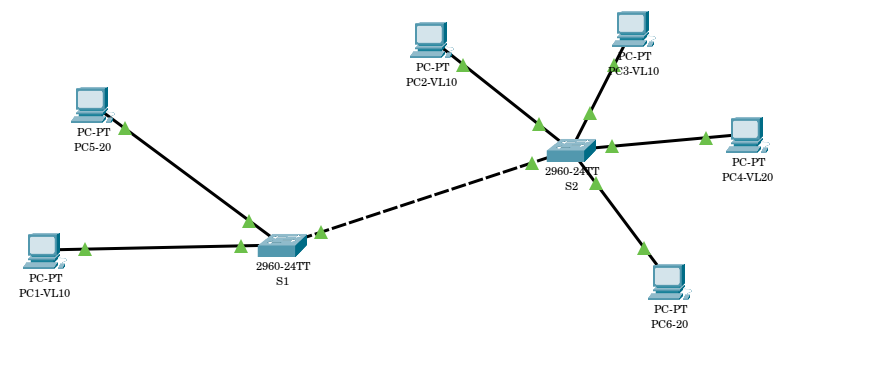
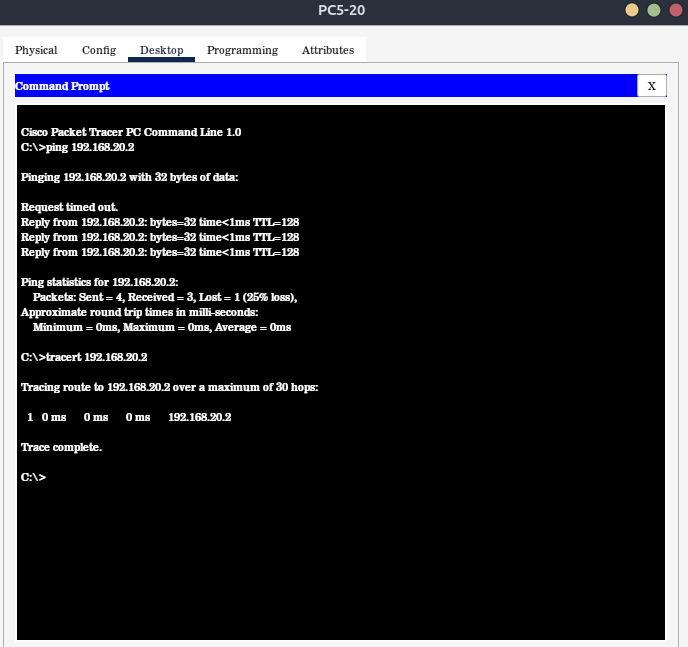

# 📚 Basic Connection with PCs and Switches with VLAN

## 📝Brief introduction
In this practical i developed a basic connetion with Cisco Packet Tracer (CPT), with several PCs and two Switches.Also the concept of Virtual LAN and how to manage several PCs with sevral Swicthes.

## 💡 What I Larned
✅: VLAN concept  
✅: How to configure Swicthes for VLAN   
✅: Creating membership inerfaces and Trunk configuration  

## 💻 Tools and Technolgies
▶️: Cisco PAcket Tracer  
▶️: 2960-24TT Swicth  
▶️: PC-PT computers  
▶️: Copper straight through  
▶️: Copper cross  

## 📊 Network Toology


## 🌐Configuration and Code Snippts

🖥️ PC-1 IPVV4 : 192.168.10.1  
🖥️ PC-2 IPVV4 : 192.168.10.2  
🖥️ PC-3 IPVV4 : 192.168.10.3    
🖥️ PC-4 IPVV4 : 192.168.20.1  
🖥️ PC-5 IPVV4 : 192.168.20.2  
🖥️ PC-6 IPVV4 : 192.168.20.3  

#### 🔲 Switch -1 Configuration
⚙️ **VLAN establishment**
```
enable
configure teminal
vlan 10
name VL10
exit
vlan 20
name VL20
exit
```
⚙️ **Membership configuration**  

*----fa0/1----*
```
enable  
configure terminal  
interface fa0/1
switchport mode access
switchport access vlan 10
exit
```
*----fa0/2----*
```
interface fa0/2
switchport mode access
switchport access vlan 20
exit
```
*----fa0/10---(trunk member)*
```
interface fa0/10
switchport mode trunk
switchport trunk native vlan 1
switchport trunk allowed vlan add 10
switchport trunk allowed vlan add 20
```

#### 🔲 Switch -2 Configuration
⚙️ **VLAN Estblishment**
```
enable
configure teminal
vlan 10
name VL10
exit
vlan 20
name VL20
exit
```
⚙️ **Membership configuration**

*----fa0/1----*
```
enable 
configure terminal
interface fa0/1
switchport mode access
switchport access vlan 10
exit
```
*----fa0/2----*
```
interface fao/2
switchport mode access
switchport access vlan 10
exit
```
*----fa0/3----*
```
interface fao/3
switchport mode access
switchport access vlan 20
exit
```
*----fa0/4----*
```
interface fao/2
switchport mode access
switchport access vlan 20
exit
```
*----fa0/10---(trunk member)*
```
interface fa0/10
switchport mode trunk
switchport trunk native vlan 1
switchport trunk allowed vlan add 10
switchport trunk allowed vlan add 20
```

## ☑️ Verfication and Testing
#### ☑️ PC1 to PC4 Ping test  
ping 192.168.20.2

#### ☑️ PC1 to PC2 Trace Route
tracert 192.168.20.2
